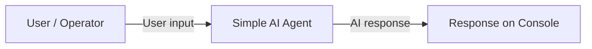
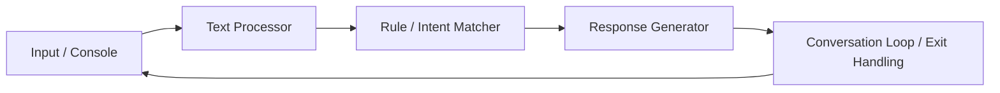
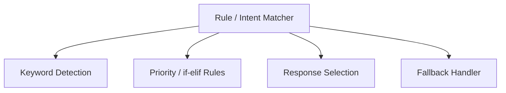

# SLE-3 Full C4 Architecture

**Course:** 02AML204 – Introduction to Artificial Intelligence  
**PRN:** 25UAM065  
**Name:** Abhishek Ajit Shirguppe  
**Division:** A  

## Level 1 – Context

## Level 2 – Container

### Containers
- **Input / Console:** accepts user messages.
- **Text Processor:** converts input to lowercase.
- **Rule / Intent Matcher:** checks predefined keyword conditions.
- **Response Generator:** returns the selected response.
- **Conversation Loop / Exit Handling:** repeats interaction and exits on `bye`.

## Level 3 – Component
Main container: **Rule / Intent Matcher**

## Level 4 – Code
- `def ai_agent(user_input)`
- `text = user_input.lower()`
- `if / elif` keyword rules
- `return` selected response
- `while True:` conversation loop
- `input("You: ")`
- `if user_input.lower() == "bye": break`

## Design Decisions
The response logic is separated into `ai_agent()`, while the interaction loop remains outside it. Lowercase conversion provides consistent matching, and a fallback response handles unsupported input safely.

## AI Contribution
ChatGPT was used for initial code assistance, code fixing, documentation, and architectural-report drafting. The student selected, reviewed, and understood the project and final architecture.
