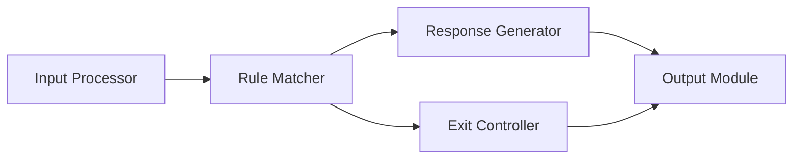

# SLE-3 Level 3 - Component Diagram

## Main Container
**Agent Engine**

The Agent Engine contains the main decision-making components of the SimpleAI Rule-Based Agent.

## Components
| Component | Responsibility |
|---|---|
| Input Processor | Receives and normalizes user input |
| Rule Matcher | Checks input against predefined conditions |
| Response Generator | Selects or prepares the appropriate response |
| Exit Controller | Handles the program exit condition |
| Output Module | Displays the final response |

## Mermaid Diagram

## Explanation
The Input Processor prepares the user input. The Rule Matcher compares the input with predefined rules. The Response Generator produces the appropriate response, while the Exit Controller handles the exit condition. Finally, the Output Module displays the result.
