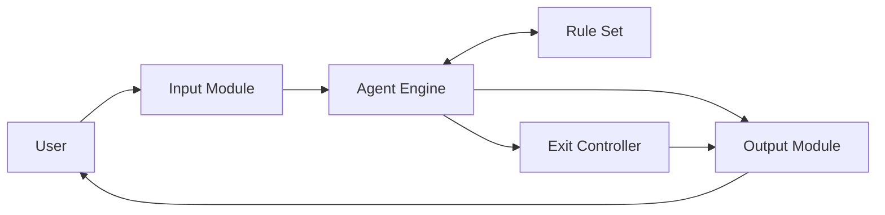

# SLE-3 Level 2 - Container Diagram

## Containers
The SimpleAI Rule-Based Agent is divided into the following logical containers:

| Container | Responsibility |
|---|---|
| Input Module | Accepts user input from the terminal |
| Agent Engine | Applies the decision-making logic |
| Rule Set | Contains predefined keyword conditions and responses |
| Output Module | Displays the response to the user |
| Exit Controller | Detects the exit condition and stops the program |

## Mermaid Diagram

## Explanation
The Input Module receives the user's message. The Agent Engine processes the message and checks the Rule Set. The Output Module displays the selected response. The Exit Controller handles the exit condition, such as the user entering `bye`.
