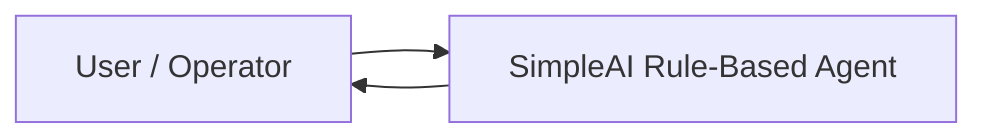

# SLE-3 Level 1 - Context Diagram

## System
**SimpleAI Rule-Based Agent**

## Context
The user interacts directly with the SimpleAI Rule-Based Agent through the terminal. The user enters a message, the agent processes it using its predefined rules, and the agent returns a response to the user.

## Mermaid Diagram

## Explanation
1. The User/Operator provides input to the AI agent.
2. The SimpleAI Rule-Based Agent processes the input.
3. The agent checks its predefined rules.
4. The agent sends the generated response back to the user.
