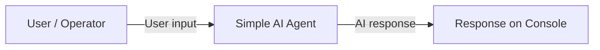
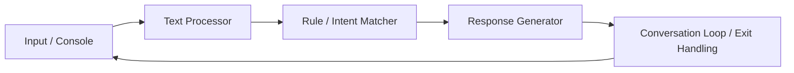
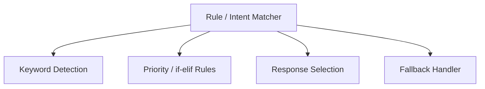

# SLE-3: Architectural Design (Full C4 Model)

**Course:** 02AML204 – Introduction to Artificial Intelligence  
**PRN:** 25UAM065  
**Name:** Abhishek Ajit Shirguppe  
**Division:** A  
**Date:** 28 September 2026  

## 1. System Title & Short Description
**Simple AI Agent – Rule-Based Conversational Agent**

The system is a basic Python AI agent that accepts text through the console and produces predefined responses. It converts input to lowercase and checks keywords such as hello, GitHub, Python, your name, help, and bye. The system demonstrates a simple AI-style decision process using rule-based matching.

## 2. Context Diagram – Level 1

The user interacts directly with the Simple AI Agent through the console. The agent receives text input, processes it using predefined rules, and returns a response. The conversation continues until the user enters `bye`.

## 3. Container Diagram – Level 2

- **Input / Console:** accepts user messages using `input()`.
- **Text Processor:** converts the message to lowercase.
- **Rule / Intent Matcher:** checks predefined keyword conditions using `if/elif` rules.
- **Response Generator:** returns the appropriate predefined response.
- **Conversation Loop / Exit Handling:** repeatedly accepts input and stops when `bye` is entered.

## 4. Component Diagram – Level 3

**Main container selected: Rule / Intent Matcher**

The Rule / Intent Matcher is divided conceptually into keyword detection, priority through if/elif rules, response selection, and a fallback handler. The fallback is used when no supported keyword is found.

## 5. Code Level Overview – Level 4

- `def ai_agent(user_input)` — main function that processes a user message.
- `text = user_input.lower()` — normalizes input for case-insensitive matching.
- `if / elif` keyword rules — identify supported requests and select responses.
- `return` — sends the selected response back to the conversation loop.
- `while True:` — keeps the agent running for multiple interactions.
- `input("You: ")` — accepts the next user message.
- `if user_input.lower() == "bye": break` — terminates the program.

## 6. Design Decisions

The system is kept modular by separating the response logic into `ai_agent()` and keeping the interaction loop outside the function. Lowercase conversion makes matching simple and consistent. A fallback response ensures that unsupported input does not crash the program.

## 7. AI Contribution Note

**AI tools used:** ChatGPT.  
**What AI helped with:** initial agent code, code fixing, README/documentation, and architectural-report drafting.  
**What I did myself:** selected the project, reviewed the generated code, used the repository, and prepared/understood the final C4 architecture.

## 8. Conclusion

The C4 model helped represent the same AI agent at four levels, from the user-facing context to the main containers, internal components, and important functions. This makes the structure easier to understand and explain. The exercise also showed how simple rule-based AI can be organized as a clear software architecture.

---
Prepared according to the SLE-3 Student Guideline: Context → Container → Component → Code.
